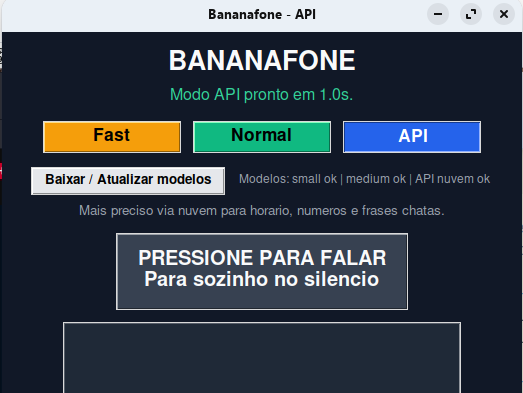

# Bananafone

Versao atual do pacote: `1.3`

Ditado para Linux com dois modos locais e um modo de API, pensado para ficar
aberto na tela durante o uso diario.

## Visao geral

`Bananafone` foi feito para uso diario no desktop:

- `Fast`: menor latencia para texto livre
- `Normal`: equilibrio entre velocidade e entendimento
- `API`: transcricao em nuvem para maior precisao em numeros, horario e frases mais chatas

O app fica residente, grava ao clicar no botao principal, para sozinho depois
de alguns segundos de silencio e copia o texto para a area de transferencia.



## Recursos

- dois modos locais com `faster-whisper` e um modo de nuvem com OpenAI
- botao grande de clique unico para iniciar a fala
- parada automatica por silencio
- atalho `Ctrl+Shift` com a janela focada no esquema segurar/soltar
- botao `Baixar / Atualizar modelos` para aquecer ou baixar cache local
- status visual do cache dos modelos `small` e `medium`
- seletor de saida: `EN` por padrao, com opcoes `PT-BR` e `PT-PT`
- botao para salvar o modo e a saida atuais como novo padrao
- log local em `~/.local/state/bananafone/bananafone.log`

No Linux, o padrao salvo fica em `~/.config/bananafone/settings.json`.

## Limitacoes

- em GNOME Wayland, `Ctrl+Shift` funciona com a janela do `Bananafone` focada
- hotkey global real exige integracao extra com o compositor ou outro daemon

## Requisitos

### Python

- Python 3.10+
- `faster-whisper`
- `SpeechRecognition`
- `numpy`
- `PyAudio`

### Binarios do sistema

- `ffmpeg`
- `wl-copy` ou `xclip`
- `python3-tk`

### Chave da API

O modo `API` usa a API de transcricao da OpenAI. O app procura a chave nesta ordem:

1. variavel de ambiente `OPENAI_API_KEY`
2. arquivo configurado em `BANANAFONE_OPENAI_KEY_FILE`
3. fallback local em `/home/aristofeles/ai/config/ai-keys.md`

Para trocar o modelo do modo `API`, use `BANANAFONE_OPENAI_MODEL`.
O padrao atual e `gpt-4o-mini-transcribe`.

A saida padrao e `EN`: voce fala em portugues e recebe texto em ingles.
As opcoes `EN` e `PT-PT` usam tambem um modelo de texto da OpenAI para
converter o resultado transcrito. Para trocar esse modelo, use
`BANANAFONE_OPENAI_TEXT_MODEL`. O padrao atual e `gpt-4o-mini`.

### Onde colocar a chave

Jeito mais simples:

1. abra `/home/aristofeles/ai/config/ai-keys.md`
2. adicione uma linha como esta:

```md
- **OpenAI (Speech):** `sua-chave-aqui`
```

Alternativas:

- exportar `OPENAI_API_KEY` antes de abrir o app
- apontar `BANANAFONE_OPENAI_KEY_FILE` para outro arquivo seu

Se existir `OpenAI (Speech)` em `ai-keys.md`, o `Bananafone` usa essa entrada
automaticamente.

## Compatibilidade

O `Bananafone` deve funcionar em GNOME ou KDE se a maquina tiver:

- Python com `tkinter`
- microfone funcional via PulseAudio ou PipeWire
- `wl-copy` no Wayland ou `xclip` no X11 para clipboard

Em KDE, a chance de funcionar e boa porque o app e Tkinter puro e nao depende
de nada exclusivo do GNOME.

Pontos de atencao:

- no Wayland, o atalho `Ctrl+Shift` continua dependendo da janela estar focada
- o launcher do menu depende de `~/.local/share/applications`, que e padrao no KDE tambem
- se o clipboard falhar, normalmente e falta de `wl-copy` ou `xclip`, nao do app em si

## Instalacao

### Jeito recomendado

Clone o repo e rode o instalador:

```bash
git clone https://github.com/cascodigital/bananafone.git
cd bananafone
./install.sh
```

O instalador:

- cria `.venv`
- instala dependencias Python
- cria launcher em `~/.local/share/applications/bananafone.desktop`
- deixa o app pronto para abrir pelo menu

### Instalacao manual

Se preferir controlar tudo na mao:

```bash
python3 -m venv .venv
source .venv/bin/activate
pip install -r requirements.txt
```

### Windows

O port Windows fica documentado em [`README_WINDOWS.md`](README_WINDOWS.md).
Resumo:

```powershell
cd caminho\para\bananafone
Set-ExecutionPolicy -Scope CurrentUser RemoteSigned
.\install_windows.ps1
```

O modo `API` usa `OPENAI_API_KEY` ou um arquivo `ai-keys.md` em
`%USERPROFILE%\.config\bananafone\ai-keys.md`.
O atalho do Windows passa a usar `pythonw.exe` quando disponivel, para abrir o
app sem console preto fixo.

## Uso rapido

```bash
./.venv/bin/python bananafone.py
```

Fluxo:

1. abra o app
2. o modo padrao e `API`
3. a saida padrao inicial e `EN`
4. troque para `PT-BR` ou `PT-PT` se quiser manter portugues
5. troque para `Fast`, `Normal` ou `API` conforme a maquina
6. se quiser que essa combinacao vire o novo padrao, clique em `Tornar atual o padrao`
7. clique no botao principal para falar
8. espere parar sozinho no silencio ou clique novamente para encerrar
9. cole o texto onde quiser

## Atualizacao

Em outra maquina, depois do clone inicial:

```bash
cd bananafone
git pull
./install.sh
```

## Distribuicao

Voce nao precisa de `.deb` para ter um fluxo logico agora.

O caminho mais simples e robusto neste momento e:

- manter o codigo no GitHub
- instalar por `git clone` + `./install.sh`
- atualizar por `git pull` + `./install.sh`

Um `.deb` so passa a valer a pena quando voce quiser:

- versao fechada por tag ou release
- desktop entry, icone e dependencias empacotados juntos
- instalacao para usuarios que nao querem nem ver terminal

Se quiser, isso pode virar um passo 2 depois. Para o estado atual do projeto,
Git + instalador e o melhor custo-beneficio.

## Desktop

O arquivo [`desktop/bananafone.desktop`](desktop/bananafone.desktop) fica como
referencia. O launcher real da maquina e gerado pelo `install.sh`.

## Estrutura

```text
bananafone/
  bananafone.py
  install.sh
  requirements.txt
  desktop/
    bananafone.desktop
```

## Desenvolvimento

Para validar a sintaxe:

```bash
python -m py_compile bananafone.py
```

## Observacoes

Na primeira execucao dos modos locais, o `faster-whisper` pode baixar o modelo
e aquecer o cache local. O botao `Baixar / Atualizar modelos` existe justamente
para isso. O modo `API` nao usa cache local do Whisper; ele envia o audio
capturado para a API de transcricao configurada. Quando a saida estiver em
`EN` ou `PT-PT`, o texto transcrito passa por conversao OpenAI antes de ser
copiado.
