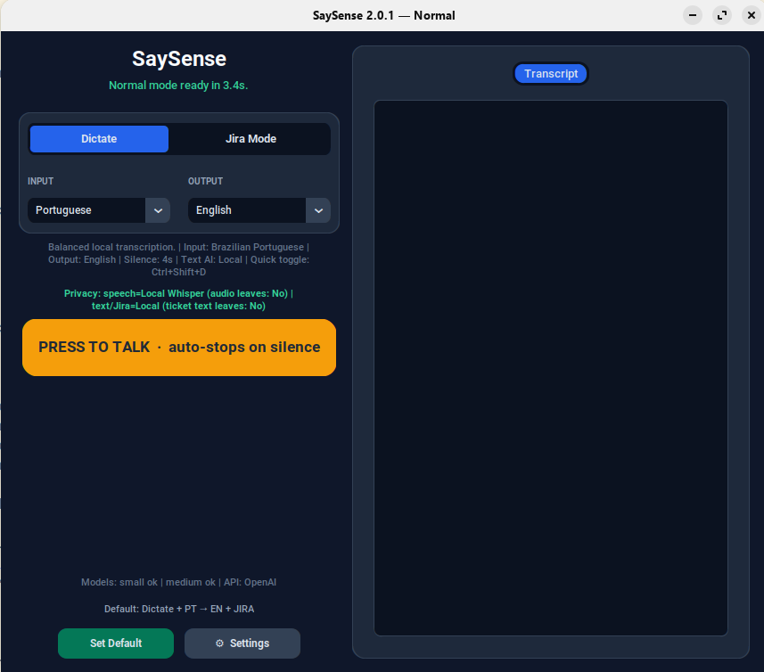
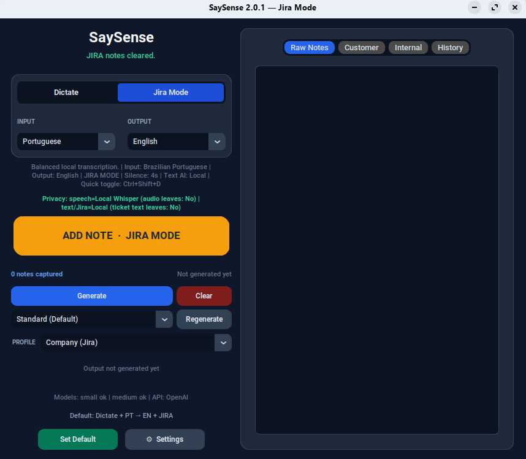
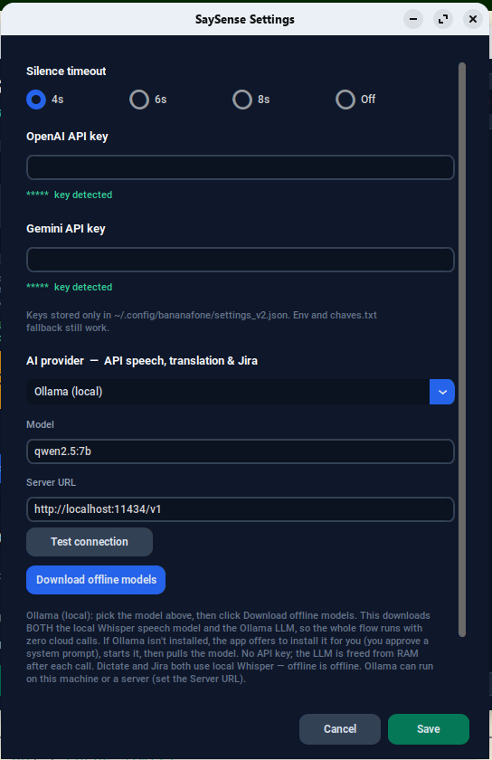

<div align="center">

# SaySense

### You speak. It makes sense.

**Dictate in Portuguese, Spanish or English — get clean, professional text in the language you need, already on your clipboard.**
Built for IT support: turn spoken case notes into ticket-ready Jira documentation in one click — and keep every word on your own machine if you want to.


</div>

---

## The problem it kills

Working tickets in a second language means living in three windows at once: a translator, a text editor, and the ticket system. You dictate or type in your head-language, paste it into a translator, clean it up, then move it into the ticket. Every. Single. Note.

SaySense collapses that loop into one hotkey. Talk in your language; polished text lands wherever your cursor is. In **Jira Mode** it goes further — dictate rough notes during the call, then generate a customer-facing reply *and* an internal worklog from all of them at once.

---

## See it

<div align="center">

| Dictate mode | Jira Mode |
|:---:|:---:|
|  |  |
| Press to talk, auto-stops on silence, result on your clipboard. | Capture notes live, then generate Customer + Internal in one click. |

<br>



*One provider selector drives speech, translation and Jira — cloud or fully local.*

</div>

---

## What it does

- 🎙️ **Press-to-talk dictation** — hold the button (or the global hotkey `Ctrl+Shift+D`), speak, and it auto-stops on silence. The result is on your clipboard before you reach for it.
- 🌍 **Language routing** — speak Portuguese, Spanish or English; output in any of the three. Brazilian-Portuguese tuned.
- 🎫 **Jira Mode** — every dictated note is cleaned into professional English as you capture it. One click turns the pile of notes into a **customer reply** + a **structured internal note**, with switchable tone/length **profiles** (Company, MSP client, Internal helpdesk, Strict).
- 🔁 **Regenerate on the fly** — shorter, more technical, more customer-friendly, or with a follow-up — without re-dictating.
- 🧠 **One AI selector, four backends** — OpenAI, Gemini, local **Ollama**, or any OpenAI-compatible endpoint. It drives speech, translation and Jira text together.
- ⚡ **Light on resources** — local models unload from RAM 60s after a call instead of squatting on your memory.

---

## 🔒 Privacy is a setting, not a promise

Most dictation tools ship your microphone to someone else's server. SaySense lets you decide, per provider — and the main window shows you the truth in real time:

> **Privacy: speech = Local Whisper (audio leaves: No) · text/Jira = Local (ticket text leaves: No)**

Pick the **Ollama + local Whisper** path and *nothing* leaves the machine: audio is transcribed locally with `faster-whisper`, and translation/Jira text runs on a local LLM. No keys, no cloud, no audit trail. Perfect for ticket content you can't legally send to a third party. Prefer speed and top-tier quality? Switch to OpenAI or Gemini in one dropdown. Your call, every time.

---

## ✨ New in 2.0

- **Real download progress** — the offline-model download (Whisper + Ollama) now shows live MB/% instead of freezing on a blank screen.
- **Bulletproof local setup** — the app finds, starts and waits for Ollama even right after a fresh install, and pulls the model for you. No more "stuck on starting / model not found."
- **Built-in updater** — checks GitHub on launch and tells you when a newer build is out.

---

## Download

Grab the latest installer from the **[Releases page](https://github.com/cascodigital/saysense/releases/latest)**:

| Platform | File |
|----------|------|
| **Windows** | `SaySense-Setup-<version>.exe` (installer) or `SaySense-Portable-<version>.zip` (no install) |
| **Linux** | `SaySense-<version>-x86_64.AppImage` |

Every asset ships with a `.sha256` checksum.

---

## Run from source

### Linux
```bash
git clone https://github.com/cascodigital/saysense.git
cd saysense
./install.sh                # app + all dependencies (apt/dnf/pacman auto-detected)
./install.sh --with-ollama  # also install Ollama for the fully-offline path
./.venv/bin/python saysense.py
```

### Windows
Double-click **`Install-SaySense.bat`**, or from PowerShell:
```powershell
.\install_windows.ps1               # installs Python via winget if missing
.\install_windows.ps1 -WithOllama   # also install Ollama
```

---

## Configuration

Everything lives in the in-app **Settings** panel:

- **API keys** — OpenAI and/or Gemini, stored only in `~/.config/bananafone/settings_v2.json` (env vars `OPENAI_API_KEY` / `GEMINI_API_KEY` also work). They never leave the local file.
- **AI provider** — one selector for speech, translation and Jira text: OpenAI, Gemini, Ollama, or a custom OpenAI-compatible URL.
- **Model & server URL** — per provider, with sane defaults. **Download offline models** fetches local Whisper + the Ollama model in one go.
- **Silence timeout** — how long to wait before auto-stopping a capture (4s / 6s / 8s / off).

No key is required for the Ollama path — the app can install Ollama and pull the model for you straight from Settings.

---

## How it works

```
 mic ──► Speech-to-text                      ──► text (input language)
         OpenAI /audio/transcriptions               │
         Gemini generateContent (WAV inline)        ▼
         faster-whisper (100% offline)        Text AI (OpenAI / Gemini / Ollama)
                                                    │
                                       ┌────────────┴────────────┐
                                       ▼                         ▼
                                    DICTATE                  JIRA MODE
                                    translated text          customer reply
                                    → clipboard              + internal note
```

---

## License

MIT — see [LICENSE](LICENSE).

<div align="center">
<sub>Project lineage: BananaPhone v1 → BananaPhone v2 → <b>SaySense</b>. Internal storage paths remain <code>bananafone</code>-compatible for backward compatibility.</sub>
</div>
