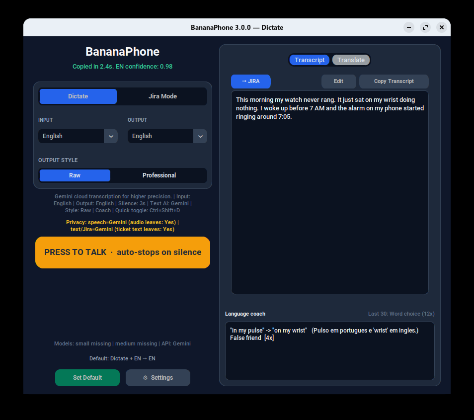
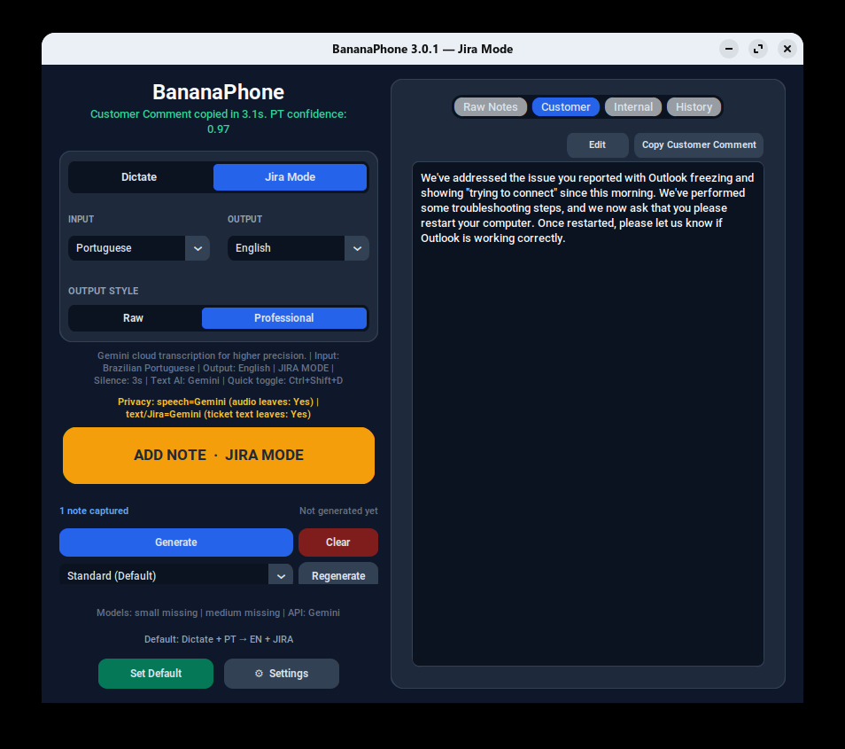
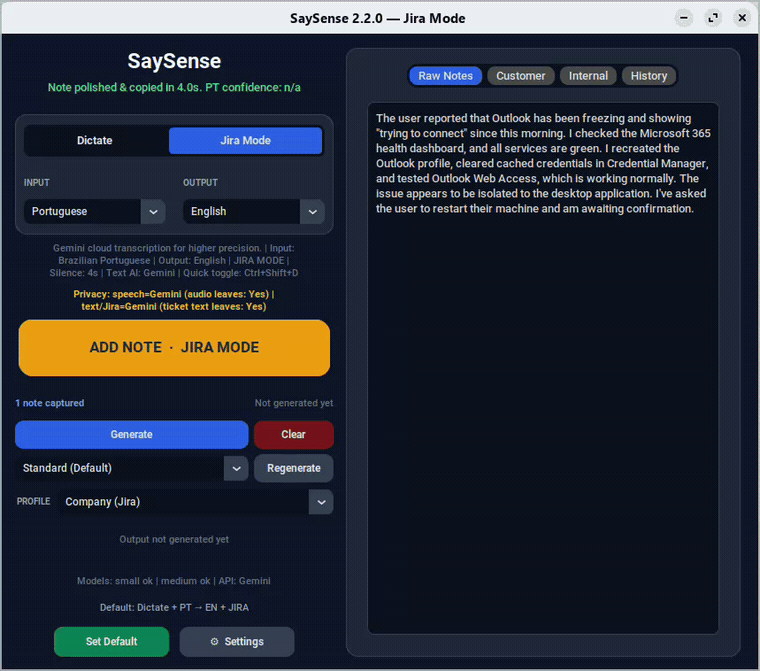
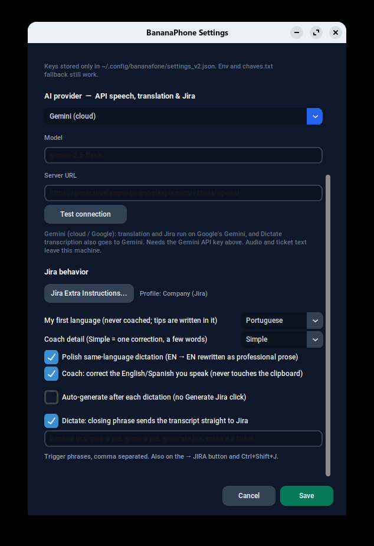

<div align="center">

# 🍌 BananaPhone

**Primate talks. I make sense.**

You grunt case notes into a microphone in whatever language your brain runs on — Portuguese, Spanish or English — and BananaPhone hands back clean, professional text in the language your tickets demand, already on your clipboard. Evolution, but for paperwork.

**Speak a language you don't have?** It translates. **Speak one you're still learning?** It polishes what you said *and tells you what you got wrong* — one correction at a time, in your own language.

Built for IT support: turn spoken case notes into ticket-ready Jira documentation in one click — and keep every word on your own machine if you want to. No banana is sent to the cloud without your consent.


</div>

---

## The problem it kills

Working tickets in a second language means living in three windows at once: a translator, a text editor, and the ticket system. You dictate or type in your head-language, paste it into a translator, clean it up, then move it into the ticket. Every. Single. Note. That's not knowledge work — that's a primate moving text between trees.

BananaPhone collapses that loop into one hotkey. Talk in your language; polished text lands wherever your cursor is. In **Jira Mode** it goes further — dictate rough notes during the call, then generate a customer-facing reply *and* an internal worklog from all of them at once. You handle the monkey business; it handles the sense-making.

### And the other half of the problem

Plenty of us *do* work in the second language — badly, at speed, all day. You write the ticket
in English yourself, it comes out clumsy, and nobody ever tells you why. Colleagues are too
polite to correct a co-worker's grammar, so you repeat the same four mistakes for years.

Since **3.0.0**, dictating in a language that is not your first gets you two things at once:
the sentence you *meant* to write, on your clipboard, and the single most important thing you
got wrong, explained in your own language — with a count of how often you keep doing it.
A spellchecker tells you a word is wrong. This tells you which mistake is *yours*.

---

## See it

**Two jobs, one window.** Speak a language you don't have and it translates. Speak one you
are still learning and it fixes what you said — then tells you what you got wrong.

<div align="center">



<em><b>Dictate.</b> You spoke English; the panel holds the sentence you <em>meant</em>. <b>OUTPUT STYLE</b> decides how hard it may rewrite you — flip it after the fact and the text re-renders without speaking again. Below, the coach: one correction, in your own language, and how often you keep making it.</em>

<br><br>



<em><b>Jira Mode.</b> Dictate rough notes in Portuguese during the call; they land in English. One <b>Generate</b> splits them into a customer-facing reply and a structured internal note — Customer / Internal / Raw Notes / History as tabs, each editable in place before you copy.</em>

<br><br>



<em>The same thing in motion — dictation to finished ticket, one click.</em>

<br><br>



<em>One provider selector drives speech, translation and Jira — cloud or fully local — with a live readout of whether audio or ticket text ever leaves the machine. Your first language, the coach's level of detail, and whether it runs at all are all settings.</em>

</div>

---

## Jira Mode, end to end

You work the call in your own language and let BananaPhone do the paperwork. This is the exact case from the demo above — what you say out loud in Portuguese, and the one-click English output that lands.

**🇧🇷 What you say out loud — Brazilian Portuguese:**

> *"cliente reportou que o Outlook está travado em 'Tentando conectar' desde hoje de manhã, verifiquei o painel do Microsoft 365, tudo verde, recriei o perfil do Outlook, limpei as credenciais em cache no Gerenciador de Credenciais e testei pelo Outlook Web, funciona normal por lá, o problema continua só no desktop, pedi pro usuário reiniciar, aguardando confirmação"*

You never see that Portuguese on screen — it's transcribed and translated as you speak, so the note lands in the **Raw Notes** tab already in English. One click on **Generate** then splits it into two audiences:

**🇺🇸 Customer Comment — English (public-facing):**

> We've addressed the issue you reported with Outlook freezing and showing "trying to connect" since this morning. We've performed some troubleshooting steps, and we now ask that you please restart your computer. Once restarted, please let us know if Outlook is working correctly.

**🇺🇸 Internal Note — English (support team only):**

> **Issue:** User reported Outlook freezing and showing "trying to connect" since this morning.  
> **Investigation:** Checked the Microsoft 365 health dashboard; all services green. Tested Outlook Web Access (OWA), working normally. The issue appears isolated to the desktop application.  
> **Actions:** Recreated the Outlook profile. Cleared cached credentials in Credential Manager. Asked the user to restart their machine.  
> **Result:** Pending user restart.  
> **Follow-up:** Awaiting user confirmation after machine restart.

Same notes, switch the **profile** to *MSP client* or *Internal helpdesk* and the tone of both fields shifts; hit **Regenerate → shorter / more technical / add follow-up** to reshape it without re-dictating a word. It reconstructs the ticket from out-of-order notes, keeps your technical identifiers (`Credential Manager`, `OWA`), and never claims a resolution you didn't dictate.

---

## The language coach, end to end

Same idea as Jira Mode, pointed at you instead of the ticket. You dictate in the language you
are learning; you get the sentence you meant, and one correction.

**🗣️ What you actually said — dictated in English by a Portuguese speaker:**

> *"Okay so I woke this morning and the watch never ring. The watch just stopped in my pulse
> doing nothing. I woke before 7 hours and the clock on my cell phone started to ring about 7:05."*

**📋 On your clipboard — `Raw` (your phrasing, errors fixed):**

> I woke this morning and my watch never rang. The watch just stopped on my wrist and did
> nothing. I woke up before 7 AM, and the alarm on my cell phone started to ring around 7:05.

**📋 Or `Professional` — one click, no re-dictating:**

> This morning, my watch did not ring. It stopped working on my wrist. I woke up before
> 7:00 AM, and my cell phone alarm started ringing around 7:05 AM.

**🎓 And in the coach panel, in *your* language:**

```
"in my pulse" -> "on my wrist"   (Pulso em português é 'wrist' em inglês.)
False friend  [4x]
```

Note what it did **not** do: `pulse` is a perfectly good English word, and a watch really does
measure a pulse — so nothing flagged it as nonsense. It was caught because the app knows a
Portuguese speaker saying *pulse* almost certainly means **wrist**. That `[4x]` is the point:
it is the fourth time you have made that class of mistake in your last 30 corrections.

Switch the coach to **Advanced** and you get up to four corrections with a full explanation
each. **Simple** is the default on purpose — a wall of corrections gets skimmed and then
ignored, which is worse than one correction that lands.

---

## 🔒 Privacy is a setting, not a promise

Most dictation tools ship your microphone to someone else's server. BananaPhone lets you decide, per provider — and the main window shows you the truth in real time:

> **Privacy: speech = Local Whisper (audio leaves: No) · text/Jira = Local (ticket text leaves: No)**

Pick the **Ollama + local Whisper** path and *nothing* leaves the machine: audio is transcribed locally with `faster-whisper`, and translation/Jira text runs on a local LLM. No keys, no cloud, no audit trail. Perfect for ticket content you can't legally send to a third party. Prefer speed and top-tier quality? Switch to OpenAI or Gemini in one dropdown. Your call, every time.

---

## ✨ New in 3.0

- **Speak the language you are learning** — until 3.0 a same-language dictation (EN → EN)
  skipped the writing layer entirely and pasted the raw transcript, stumbles included. Only
  translated routes ever got professional prose. Now every route goes through it.
- **Output style: `Raw` | `Professional`** — how hard the model may rewrite you, on every
  route. `Raw` fixes speech-to-text artifacts and outright errors but keeps your sentence
  structure and bluntness; `Professional` rewrites for the audience it infers.
- **Restyle what you already said** — flip the style *after* speaking and the panel and
  clipboard re-render. Each style is generated once per dictation and cached: the first flip
  costs one call, every flip after that is instant.
- **Language coach** — one correction per dictation (or four in Advanced), written in your
  first language, from a closed set of categories so the mistakes can actually be counted.
  It never touches the clipboard, runs off the work path on its own thread, and is off in
  Jira Mode.
- **A counter that can show improvement** — the panel ranks your weaknesses over the last 30
  corrections, not all time. A lifetime total can only grow, so it could never show you
  getting better; a category you stop making now drops out of the window.
- **Your first language is a setting**, detected from the OS on first run. It decides what is
  never coached and what language the corrections are written in — Portuguese, Spanish or
  English, learning any of the others.
- **Jira Mode is untouched** and keeps its 2.6 behaviour exactly.

Full detail, including the seven bugs found while building it and the measured API cost:
**[RELEASE_NOTES_3.0.0.md](RELEASE_NOTES_3.0.0.md)**.

---

<details>
<summary><b>Earlier releases (2.0 → 2.6)</b></summary>

<br>

## ✨ New in 2.6

- **Internal notes in prose by default** — the forced section skeleton is gone; an empty
  section list is now a valid, meaningful choice per profile.

## ✨ New in 2.5

- **You already have the text? Paste it** — a **Translate** tab next to Transcript takes text you did not dictate (an e-mail, a chat message, a ticket someone else wrote) and translates it into the selected OUTPUT language. Structure survives: line breaks, lists, signatures, ticket IDs, error codes and commands come out untouched. **Ctrl+Enter** fires it, **Paste** pulls the clipboard in, and the result lands in the Transcript panel — copied, editable, and one click from **→ JIRA**.
- **Silence timeout starts at 3s** — the old 4s / 6s / 8s ladder made every capture wait around after you stopped talking. Now 3s / 4s / 5s / 8s, with 3s as the default.

## ✨ New in 2.4

- **Dictated it as a plain note, want a ticket anyway** — no retyping. Close the dictation with a spoken trigger phrase (default *"banana jira"*, editable in Settings) and the transcript jumps into Jira Mode and generates itself. Works with the window hidden after a hotkey dictation, when there is nothing to click.
- **Same jump, two other ways** — a **→ JIRA** button on the Transcript panel and the global `Ctrl+Shift+J` hotkey, both taking the transcript box as-is, edits included.
- **A Windows install that survives you** (2.4.1 / 2.4.2) — the installer now picks a Python version PyAudio actually ships wheels for, installs dependencies so one failure can't silently gut the rest, and copies the app into `%LOCALAPPDATA%\BananaPhone` instead of running from the unzipped Downloads folder you were about to delete.

## ✨ New in 2.3

- **One name, everywhere** 🍌 — window, taskbar, installer and launchers all say BananaPhone. Same app, same settings, same update path — upgrades install straight over any 2.2.x build.
- **History you can actually use** — click any entry in the History tab to select it; **Reopen**, **Copy Customer** and **Copy Internal** now act on the selected ticket, not just the latest one.
- **A face in the crowd** — proper banana icon in the title bar, taskbar and dock on both Windows and Linux, instead of the generic Python/Tk placeholder.

## ✨ New in 2.2.1

- **Window stops hogging the foreground** — the dictation window pops to the front when you summon it, then releases *always-on-top* after a moment instead of staying glued over every other window for its entire lifetime.

## ✨ New in 2.2

- **Edit before you copy** — Customer Comment, Internal Note and the Dictate transcript are read-only by default but flip to editable with a single **Edit** toggle. Fix a name, a path, a tone the model overcooked — then copy. No round-trip through Regenerate for a one-word change.
- **Copy Transcript** — the Dictate tab gets its own copy button, so the polished transcript is one click away even after you've moved focus.

## ✨ New in 2.1

- **Local Jira that's actually usable** — the offline path now matches the cloud output far more closely: section structure is enforced deterministically, technical identifiers (paths, IDs) are kept verbatim, and the public Customer Comment is re-derived in a dedicated jargon-stripping pass so internal tooling never leaks to the end user. A small local model finally produces a clean, coherent ticket.
- **Pick your local quality** — choose **7B (Balanced)** to run anywhere (even CPU-only) or **14B (Best quality)** for sharper output on a GPU. The picker shows the download size and detects whether this machine has a GPU, so the recommendation is honest — no model tags to memorize.
- **One-shot Jira** — optional *Auto-generate after each dictation*: speak your note once and the ticket is generated automatically, no extra click.

## ✨ New in 2.0

- **Real download progress** — the offline-model download (Whisper + Ollama) now shows live MB/% instead of freezing on a blank screen.
- **Bulletproof local setup** — the app finds, starts and waits for Ollama even right after a fresh install, and pulls the model for you. No more "stuck on starting / model not found."
- **Built-in updater** — checks GitHub on launch and tells you when a newer build is out.

</details>

---

## Download

Grab the latest installer from the **[Releases page](https://github.com/cascodigital/bananaphone/releases/latest)**:

| Platform | File |
|----------|------|
| **Windows** | `BananaPhone-Setup-<version>.exe` (installer) or `BananaPhone-Portable-<version>.zip` (no install) |
| **Linux** | `BananaPhone-<version>-x86_64.AppImage` |

Every asset ships with a `.sha256` checksum.

---

## Run from source

### Linux
```bash
git clone https://github.com/cascodigital/bananaphone.git
cd bananaphone
./install.sh                # app + all dependencies (apt/dnf/pacman auto-detected)
./install.sh --with-ollama  # also install Ollama for the fully-offline path
./.venv/bin/python bananaphone.py
```

### Windows
Double-click **`Install-BananaPhone.bat`**, or from PowerShell:
```powershell
.\install_windows.ps1               # installs Python via winget if missing
.\install_windows.ps1 -WithOllama   # also install Ollama
```

---

## Configuration

Everything lives in the in-app **Settings** panel:

- **API keys** — OpenAI and/or Gemini, stored only in `~/.config/bananafone/settings_v2.json` (env vars `OPENAI_API_KEY` / `GEMINI_API_KEY` also work). They never leave the local file.
- **AI provider** — one selector for speech, translation and Jira text: OpenAI, Gemini, Ollama, or a custom OpenAI-compatible URL.
- **Model & server URL** — per provider, with sane defaults. **Download offline models** fetches local Whisper + the Ollama model in one go.
- **Silence timeout** — how long to wait before auto-stopping a capture (3s / 4s / 5s / 8s; default 3s).
- **My first language** — never coached, and the language your corrections are written in.
  Detected from your OS locale on first run; change it if the guess is wrong.
- **Coach detail** — `Simple` (one correction, two lines) or `Advanced` (up to four, with a
  full explanation each). Simple is the default and is also the cheaper of the two.
- **Polish same-language dictation** — turn it off to get the pre-3.0 behaviour back, where
  a same-language dictation is pasted exactly as transcribed and never reaches the text model.

No key is required for the Ollama path — the app can install Ollama and pull the model for you straight from Settings.

---

## How it works

```
 mic ──► Speech-to-text                    ──► raw text (the language you spoke)
         OpenAI /audio/transcriptions             │
         Gemini generateContent (WAV)             ▼
         faster-whisper (100% offline)      Text AI  ── style: Raw | Professional
                                                  │
                                 ┌────────────────┴────────────────┐
                                 ▼                                 ▼
                              DICTATE                          JIRA MODE
                       polished / translated text            customer reply
                              → clipboard                  + internal note
                                 │
                                 └──► LANGUAGE COACH  (only if you spoke a
                                      raw vs polished   language that is not
                                      → panel only,     your first; never in
                                      never clipboard   Jira Mode)
```

The coach is a second, separate pass that starts **after** your text is already on the
clipboard. It cannot delay your work and it cannot cost you a dictation if it fails.

---

## Support

BananaPhone is free and MIT-licensed. If it saves you a few tickets' worth of typing, you can throw a coffee (or a banana) my way — entirely optional, never gated.

[](https://www.paypal.com/donate/?business=andre%40kittler.com.br&item_name=Support+BananaPhone&currency_code=USD)

---

## License

MIT — see [LICENSE](LICENSE).

<div align="center">
<sub>Project lineage: BananaPhone v1 → v2 → <b>v3</b>. 🍌<br>Internal storage paths remain <code>bananafone</code>-compatible for backward compatibility.</sub>
</div>
