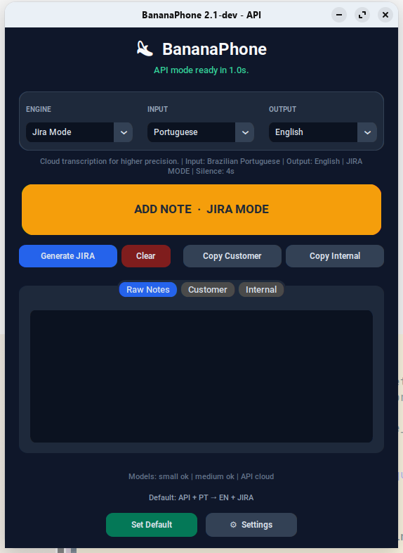

# BananaPhone v2

Experimental parallel version. It does not replace `bananafone.py`.



The GUI was redesigned with [CustomTkinter](https://github.com/TomSchimansky/CustomTkinter):
rounded controls, a dark theme, a compact route card, and a tabbed Jira panel.

Functional snapshot:

- [`docs/bananaphone-v2-current-state.md`](docs/bananaphone-v2-current-state.md)
- [`docs/bananaphone-v2.1-observations.md`](docs/bananaphone-v2.1-observations.md)

Install (Linux):

```bash
./install.sh
```

Install (Windows):

```powershell
.\install_windows.ps1
```

Run it directly:

```bash
./.venv/bin/python bananaphone_v2.py
```

If `.venv` has not been created in this checkout yet, syntax validation can use:

```bash
python3 -m py_compile bananaphone_v2.py
```

## Current v2 scope

- English UI under the visible app name `BananaPhone`
- Separate input language selector: `EN`, `PT`, `ES`
- Separate output language selector: `EN`, `PT`, `ES`
- `Jira Mode` as an Engine option
- Default input/output: `EN -> EN`
- Visible engines: `Normal`, `API`
- Settings window for:
  - silence timeout: `4s`, `7s`, `10s`, `Off`
  - OpenAI API key and Gemini API key, each with a detected/missing indicator (env, settings, or `chaves.txt`)
  - Single AI provider selection for API speech, translation & Jira: `OpenAI`, `Gemini`, `Ollama` (local), or custom OpenAI-compatible URL. API-mode speech follows the provider (`Gemini` -> native generateContent with `gemini-2.5-flash`; everything else -> OpenAI audio/transcriptions)
  - local model download/update
- Separate settings file: `~/.config/bananafone/settings_v2.json`
- Separate log file: `~/.local/state/bananafone/bananaphone_v2.log`
- Modern CustomTkinter dark UI
- Linux launcher (`install.sh`) and Windows launcher (`install_windows.ps1`)
- Optional standalone Windows `.exe` build (`build_windows_exe.ps1`)

## Behavior

`Normal` engine always transcribes locally with faster-whisper. `API` engine transcribes in the cloud with the selected speech provider (OpenAI or Gemini).

If input and output are the same language, the app copies the transcription directly.

If input and output are different languages, the app uses the configured Text AI provider (OpenAI, Gemini, Ollama, or custom) to rewrite the dictated text into the selected output language.

`JIRA MODE` uses the configured Text AI provider to generate two fields:

- `Customer Comment`
- `Internal Note`

In `JIRA MODE`, the main button adds each dictation to `Raw Notes`. Use `Generate JIRA` when the notes are ready.

The Jira panel has three tabs:

- `Raw Notes`
- `Customer`
- `Internal`

After `Generate JIRA`, the app copies only `Customer Comment` automatically. `Customer` and `Internal` also have copy buttons.

In `JIRA MODE`, the generated Jira text uses the selected output language. For example:

- `Input PT` + `Output EN` + `JIRA MODE`: speak Portuguese, generate Jira text in English
- `Input PT` + `Output PT` + `JIRA MODE`: speak Portuguese, generate Jira text in Portuguese

`Off` silence timeout means recording continues until the main button is clicked again.
